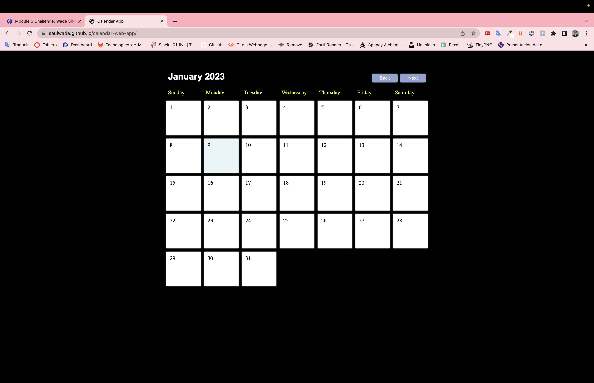

This is a fully interactive Calendar App coded with HTML, CSS & JAVASCRIPT.

I didn´t use the starter code because I wanted to use other resources to make the app look nicer, I got help from friends and a few tutorials.

This is the link of the website: https://saulwade.github.io/calendar-web-app/

And this is a preview:

